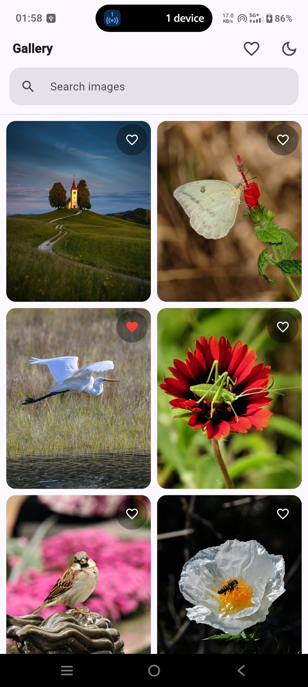
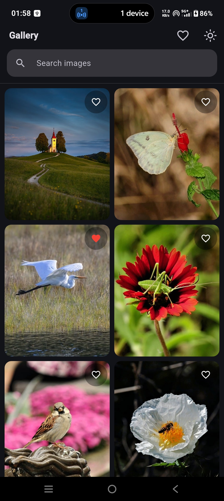
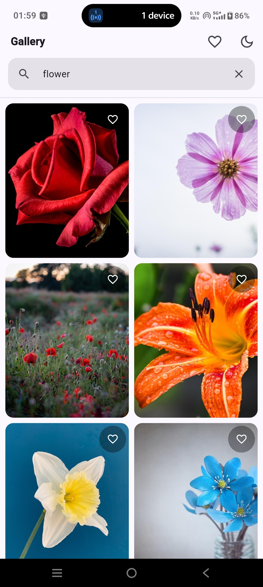
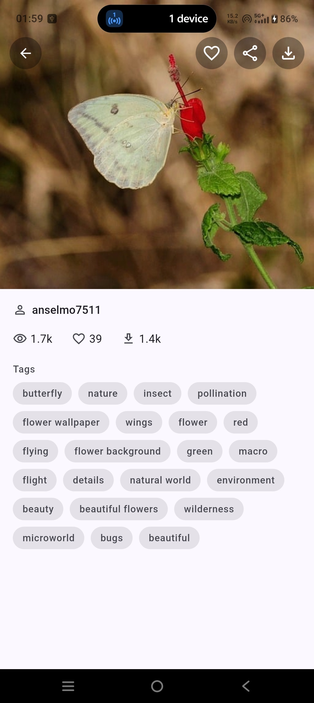
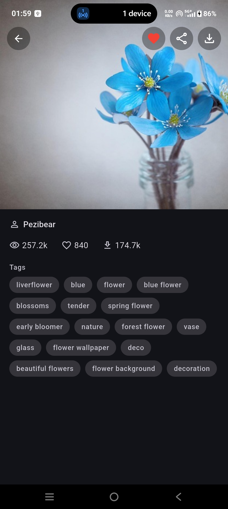
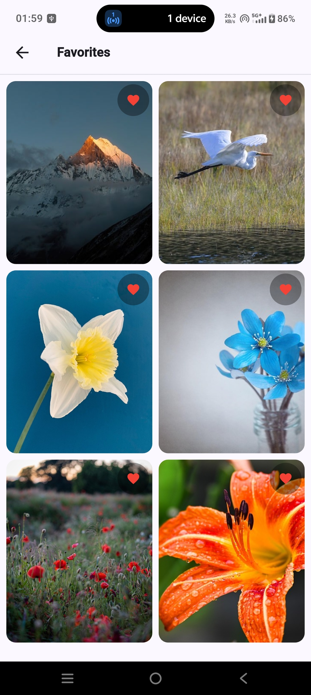

# Image Gallery

A Flutter app that shows images from the [Pixabay API](https://pixabay.com/api/docs/). You can search, scroll endlessly, open an image, download or share it, and save favorites.

## Screenshots

| Gallery (light) | Gallery (dark) | Search |
|---|---|---|
|  |  |  |

| Image detail (light) | Image detail (dark) | Favorites |
|---|---|---|
|  |  |  |

## Run it

1. Install Flutter (Dart `^3.12.2`).
2. Get a free API key from [pixabay.com/api/docs](https://pixabay.com/api/docs/).
3. Create your key file and run:

```
flutter pub get
cp env.example.json env.json      # put your key inside env.json
flutter run --dart-define-from-file=env.json
```

`env.json` is gitignored, so the key never goes into the repo. For a release build use `flutter build apk --dart-define-from-file=env.json`.

Run the tests with `flutter test`.

## Folder structure

```
lib/
  core/      constants, Dio setup, helpers, routes, theme
  data/      models, repository (network), providers (app-wide state)
  domain/    view models (state for one screen)
  ui/        screens, and the widgets they use
```

The rule is simple: the UI never talks to the network. It reads state from Riverpod, and Riverpod gets its data from the repository.

```
UI (ConsumerWidget)  ->  Provider / ViewModel  ->  Repository  ->  Dio  ->  Pixabay
```

- **core/apis**: one `Dio` instance. An interceptor adds the API key to every request, and errors are turned into one `ApiException`.
- **data/repositories**: the repository is the only class that calls the API. It returns ready-to-use models, so the rest of the app never touches Dio.
- **ui/widgets**: widgets used by more than one screen (image tile, favorite button, error view).
- **ui/features/<name>/widgets**: widgets used by only one screen.

## Riverpod: what is used where, and why

The app uses `flutter_riverpod` with `Notifier` classes. There are three of them, split into two kinds.

| State | Provider | Lives in | Used by |
|---|---|---|---|
| Theme mode | `themeModeProvider` | `data/providers` | `MyApp`, theme toggle button |
| Favorites | `favoritesProvider` | `data/providers` | Favorites screen, heart button on every tile and on the detail screen |
| Gallery list, search, paging | `galleryViewModelProvider` | `domain/vms` | Gallery screen |

### Providers: state shared by the whole app

`themeModeProvider` and `favoritesProvider` are plain `NotifierProvider`s. They stay alive for the whole app session.

Why: several screens read the same data at the same time. The heart button on a gallery tile and the Favorites screen must always agree. If this state lived inside one screen it would be lost on navigation. Both providers also save to `shared_preferences`, so they survive an app restart.

### View model: state of one screen

`GalleryViewModel` is a `NotifierProvider.autoDispose`. It holds the loaded images, the search text, the page number and the loading and error flags.

Why `autoDispose`: this state belongs to the Gallery screen only. When the screen is no longer watched, the list is thrown away, and the next visit starts fresh. It does not hold memory for no reason.

The repository is passed into the view model through its constructor. In tests we replace it with a mock using `overrideWith`, so no real network call is needed.

### watch vs read

- `ref.watch` is used in `build` to rebuild when state changes.
- `ref.read(...notifier)` is used in button callbacks to call a method, such as `toggle()` or `loadNextPage()`.
- Only the widget that draws the data calls `watch`. For example, `GalleryView` only reads the notifier, and `GalleryBodyWidget` watches the state. So typing in the search bar does not rebuild the whole screen.
- `FavoriteButtonWidget` uses `.select(...)` to watch only "is this image a favorite?". Adding one favorite does not rebuild every tile on the screen.

### Why Riverpod

- State lives outside the widget tree, so it is easy to test with a plain `ProviderContainer`.
- `autoDispose` and `select` give control over lifetime and rebuilds with very little code.
- Dependencies can be swapped in tests (`overrideWith`) without a service locator.

## Pagination

`GalleryViewModel` keeps the current page and the total in a `PaginationModel`. `hasMore` is true while `images.length < total`. When the user scrolls to the bottom (`lazy_load_scrollview`), `loadNextPage()` adds the next page to the list.

If page 1 fails, the screen shows an error with a retry button. If a later page fails, the images already loaded stay on screen and a toast is shown. A bad connection never clears what the user is looking at.

## Image performance

The grid uses Pixabay's smaller `webformatURL`, and `CachedNetworkImage` decodes it at a capped size (`memCacheWidth` / `memCacheHeight`). The big `largeImageURL` is only loaded when downloading or sharing.

## Tests

- `GalleryViewModel`: paging, search, and first-page vs next-page errors (mock repository with `mocktail`).
- `FavoritesNotifier`: toggle and saving/loading from storage.
- Model JSON parsing.
- A few widgets: error view, input field, stat, tag pill, empty favorites.

## Limits

- Pixabay does not return an image description, so the detail screen shows the uploader, tags and stats instead.
- No category filter or masonry layout.
- Download and share show a spinner, not a percentage.
- A missing API key is not handled specially. Requests just fail and show the normal error screen.
- Built and tested on Android only. iOS has the photo-library permission text set (`NSPhotoLibraryAddUsageDescription`) but has not been run.
